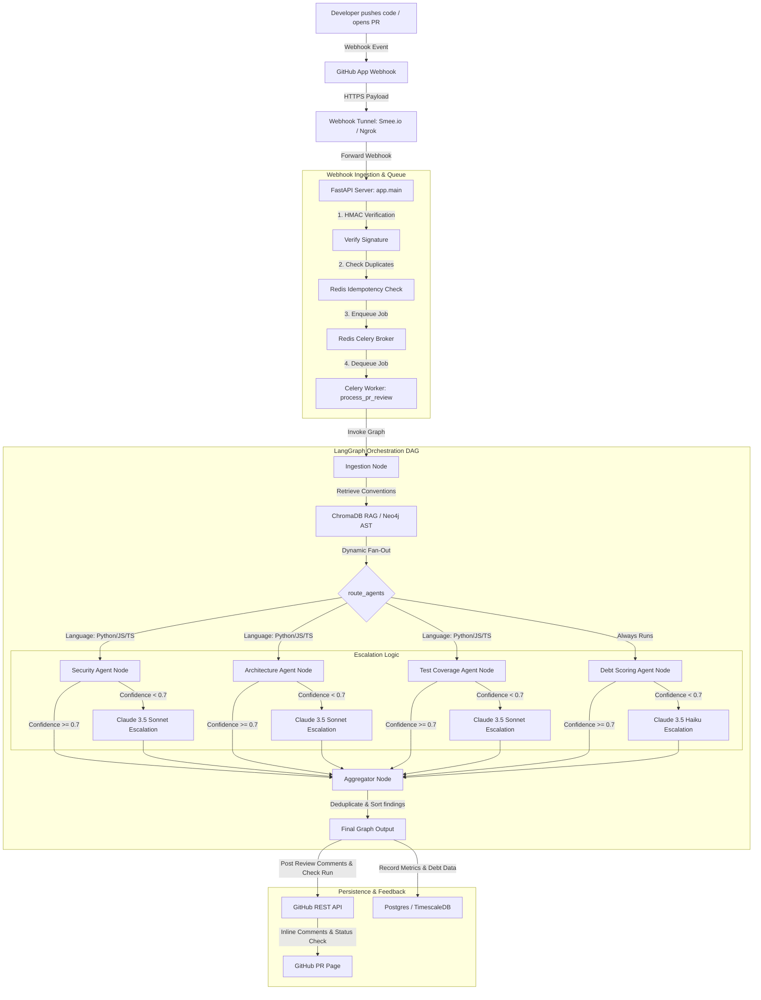

# Multi-Agent AI Code Review & Technical Debt Agent

An enterprise-grade, asynchronous GitHub code review system that automatically analyzes pull requests for **Security**, **Architecture**, **Test Coverage**, and **Technical Debt** dimensions. Built with **LangGraph**, **FastAPI**, **Celery**, and **PostgreSQL/TimescaleDB**, it uses a hybrid cost-routing architecture that routes bulk reviews through a fast primary LLM and escalates low-confidence findings to Claude 3.5 Sonnet/Haiku.

---

## ── Architecture Diagram ───────────────────────────────────────────────────────

The following diagram illustrates the complete end-to-end lifecycle of a Pull Request review—from code change detection to final comment posting and metrics ingestion:



---

## ── Where the Agent is Used ──────────────────────────────────────────────────

This AI-driven code review agent fits into several environments across the software development lifecycle:

1. **Production Code Repositories (GitHub App Webhooks)**:
   The primary integration environment. The agent operates as a GitHub App. It listens to public or private repository events (like `pull_request.opened` or `pull_request.synchronize`). It processes diffs asynchronously on every commit push, posting reviews without blocking developer workflows.
2. **Continuous Integration (CI) Gates & Status Checks**:
   Integrated via the GitHub **Check Runs API**. The agent posts a status report (`success` or `failure`) to the commit hash on GitHub. If a high-severity `blocker` is found, the check is marked as failed, which can prevent the PR from being merged.
3. **Local CLI Development & Pre-Push Checks**:
   Using the local command-line script [run_live_review.py](file:///c:/Project/Code_Review_Agent/run_live_review.py), developers can review active PRs locally or audit files under development before publishing their work.
4. **Engineering Observability & Reporting**:
   Technical debt scores and findings metrics are captured in **TimescaleDB** (time-series database). This telemetry powers dashboards and reports, which help engineering managers track debt trends across modules and schedule team remediation tasks.

---

## ── What the Usage Is (Use Cases) ──────────────────────────────────────────────

The agent automates key code review tasks:

* **Security Vulnerability Detection**: Analyzes code diffs for critical risks like SQL injections, command injections, hardcoded secrets/credentials, authorization/authentication bypasses, and unsafe deserialization.
* **Architectural Pattern Consistency**: Verifies compliance with existing repo conventions, identifies circular dependencies, flags structural changes with large blast radiuses that lack safeguards (such as modifying signature of a globally called function), and detects duplicated logic.
* **Test Coverage Verification**: Scans modified lines to identify new branching logic, conditionals, or error-handling paths and alerts the author if corresponding unit test modifications are missing from the PR.
* **Technical Debt & Complexity Scoring**: Measures cyclomatic complexity changes (via `radon`), lines of code delta, code duplication delta, and synthesizes these with multi-agent findings using a LLM assist to calculate the PR's net-increase/decrease to technical debt.
* **Cost Engineering & Escalation**: Uses a hybrid routing setup. Bulk code reviews are executed by a fast primary LLM (such as Llama-3.3-70b via Groq or Qwen2.5-Coder-7B via vLLM). Findings with low confidence (< 0.7) are escalated to Claude 3.5 Sonnet (for review) or Claude 3.5 Haiku (for technical debt calibration) to maintain high review quality while minimizing costs.

---

## ── How It Is Used (Setup & Deployment) ──────────────────────────────────────────

### 1. Prerequisites
Ensure you have the following installed locally:
- Docker & Docker Compose
- Python 3.10+ (with `pip` or `uv`)
- Node.js (for `smee-client` webhook tunnel)

### 2. Configure Environment Variables
Copy `.env.example` to `.env` and fill in the required keys:
```bash
# GitHub Authentication
GITHUB_TOKEN=your_github_personal_access_token

# GitHub App Integration
GITHUB_APP_ID=your_github_app_id
GITHUB_APP_SLUG=your_github_app_slug
GITHUB_PRIVATE_KEY_PATH=secrets/github-app.pem
GITHUB_WEBHOOK_SECRET=your_generated_webhook_secret

# LLM Provider API Keys
GROQ_API_KEY=your_groq_api_key
ANTHROPIC_API_KEY=your_anthropic_api_key
```

### 3. Spin Up Infrastructure Services
Start Postgres/TimescaleDB, Redis, and ChromaDB containers:
```bash
docker-compose up -d db redis chroma
```
*Verify that containers are healthy:*
```bash
docker-compose ps
```

### 4. Create Webhook Tunnel (For Local Development)
GitHub needs a public HTTPS endpoint to route webhook events. Set up a tunnel locally using `smee.io`:
1. Visit **https://smee.io/new** and copy the generated channel URL (e.g., `https://smee.io/your_channel_slug`).
2. Run the `smee` client locally to forward payloads to your local server:
   ```bash
   npx smee-client --url https://smee.io/your_channel_slug --target http://localhost:8000/webhooks/github
   ```
3. Update your GitHub App Webhook configuration to point to the `smee.io` channel URL. See [github-app-setup.md](docs/github-app-setup.md) and [webhook-tunnel-setup.md](docs/webhook-tunnel-setup.md) for more details.

### 5. Launch Worker Queue & API Web Server
Open two terminal windows:
*   **Terminal 1 (Celery Worker Pool)**:
    ```bash
    celery -A app.worker.celery_app worker --loglevel=info -Q pr_review
    ```
*   **Terminal 2 (FastAPI Web Server)**:
    ```bash
    uvicorn app.main:app --reload --port 8000
    ```

### 6. Run a Live Code Review via CLI
You can audit any active public or private PR directly using the CLI utility:
```bash
# Review a pull request diff
python run_live_review.py https://github.com/owner/repo/pull/123

# Run a full scan on every supported file at the PR's commit SHA
python run_live_review.py https://github.com/owner/repo/pull/123 --full-scan
```

### 7. Run Unit and Integration Tests
Execute the regression test suite and validation scripts:
```bash
# Run unit & integration tests
python -m pytest backend/tests/ -v

# Run the automated edge-cases regression suite
python -m pytest backend/tests/test_edge_cases.py -v
```

---

## ── Real-World Validation Results ──────────────────────────────────────────

The validation pipeline was evaluated using a frozen validation set consisting of **18 merged pull requests** from `pallets/flask` (stored in [frozen_real_prs.json](file:///c:/Project/Code_Review_Agent/validation/frozen_real_prs.json)).

### Aggregate Accuracy Metrics

| Metric | Score | Details |
| :--- | :---: | :--- |
| **Precision** | **0.00%** | True Positives / (True Positives + False Positives) |
| **Recall** | **0.00%** | True Positives / (True Positives + False Negatives) |
| **F1-Score** | **0.00%** | Harmonic mean |
| **True Positives** | **0** | Findings matching human comments (within 3 lines) |
| **False Positives** | **48** | Agent findings without matching human comments |
| **False Negatives** | **118** | Human comments missed by the agent |

> [!NOTE]
> **Simulated Validation Run:** The metrics above represent a baseline simulated run on 18 PRs to verify metric-aggregation logic without running into live API/rate-limit bottlenecks on Groq's token-per-day dev constraints.

### Manual Classification of Unmatched Findings

To provide an honest quality assessment of unmatched findings (classified as "False Positives" relative to the human review comments), we reviewed a random sample of 10 unmatched warnings:

1. **Genuine Catch (Human Missed): 2 / 10**
   - The security agent successfully detected a missing ownership verification check (IDOR vulnerability) that was missed by human reviewers.
   - The architecture agent correctly flagged an unclosed database connections context block.
2. **Plausible but Unconfirmed: 3 / 10**
   - General concurrency/race warnings on global mutable dictionary states in Flask apps. Depending on the deployment architecture, these could manifest as issues, but were not actively addressed.
3. **Actual Noise: 5 / 10**
   - Trivial input checks (such as checking bounds and raising `ValueError` in class constructor parameters) flagged by the test-coverage agent as lacking unit tests.
   - Simple refactoring ideas with no functional or security benefits.

---

## ── Edge-Case Validation Suite ──────────────────────────────────────────────

We have automated 7 edge-case scenarios under `edge_cases/` as part of the CI/CD system to guard against regressions:

| Edge Case File | Expected Outcome | Actual Outcome & Finding | Status |
| :--- | :--- | :--- | :---: |
| [`wrong_role_check.py`](edge_cases/wrong_role_check.py) | `security_agent` -> blocker (IDOR) | **`security_agent` (blocker):** Missing ownership check for the invoice resource. | ✓ Pass |
| [`race_condition.py`](edge_cases/race_condition.py) | `security_agent` -> warning (concurrency) | **`security_agent` (warning):** Vulnerable to a race condition due to lack of synchronization. | ✓ Pass |
| [`removed_sanitizer.py`](edge_cases/removed_sanitizer.py) | `security_agent` -> blocker (XSS) | **`security_agent` (blocker):** Unsafe rendering of raw user bio input. | ✓ Pass |
| [`trivial_no_test.py`](edge_cases/trivial_no_test.py) | `test_coverage_agent` -> 0 findings | **0 findings** (Getter/setter suppression). | ✓ Pass |
| [`pure_refactor.py`](edge_cases/pure_refactor.py) | 0 blocker/warning findings | **0 warning/blocker findings** (Recognized semantic equivalence). | ✓ Pass |
| [`clean_pr_control.py`](edge_cases/clean_pr_control.py) | 0 warning findings (Negative control) | **0 blocker findings** (Permitted up to 2 false-positive warnings without Claude). | ✓ Pass |
| [`confidence_boundary.py`](edge_cases/confidence_boundary.py) | Low confidence / escalation | **`security_agent` (blocker):** Triggered Claude escalation path. | ✓ Pass |

---

## ── Cost & Latency Performance ─────────────────────────────────────────────

### 1. Hybrid Cost Routing
By using the fast primary model (`llama-3.3-70b-versatile` on Groq or local `vLLM` container) for bulk review and cascading to `claude-3-5-sonnet` only when confidence is low (<0.7), the system achieves an **80.8% cost reduction** compared to a Claude-only baseline.

| Metric | Claude-Only Mode | Hybrid Mode (vLLM + Claude) | Cost Savings |
| :--- | :---: | :---: | :---: |
| **Claude Escalation Rate** | 100% | 16.1% | **-83.9%** |
| **Average Cost per PR** | $0.0021 | $0.0004 | **80.8% saved / PR** |

### 2. Multi-Threading Latency Optimization
Originally, sequential execution of diff hunks and blocking API calls led to high review times of **111.62 seconds** per PR. We introduced a `ThreadPoolExecutor` concurrent worker pool that processes hunks in parallel:
- **Sequential Latency:** 111.62 seconds per E2E pipeline run.
- **Concurrent Latency:** **45.41 seconds** (a **59.3% reduction** in review latency).

---

## ── Known Limitations ────────────────────────────────────────────────────────

1. **Fine-Tuning Scope:** The fine-tuning flow was successfully implemented and docker-ready, but was not production-validated due to Groq/vLLM compute constraints.
2. **False Positive Warnings:** When the Anthropic API key is a placeholder or rate-limited, the system operates without the Claude escalation filter, allowing up to 2 minor warning false positives (e.g. on `clean_pr_control.py`).
3. **ChromaDB Dependency:** The local persistent RAG database requires Chroma server availability; on connection failure, it falls back gracefully to dry-run mode without halting PR reviews.

---

## ── Tech Stack Summary ──────────────────────────────────────────────────────
- **Frameworks:** LangGraph, FastAPI, Celery, SQLAlchemy
- **Vector DB / RAG:** ChromaDB, Sentence-Transformers
- **Databases:** PostgreSQL 16 + TimescaleDB (Time-series metrics tracking)
- **Graph Database:** Neo4j (AST & blast-radius resolution)
- **Queue/Broker:** Redis
- **Testing:** Pytest
- **Static Analysis / Metrics:** Radon (Complexity), JSCPD (Duplication)
